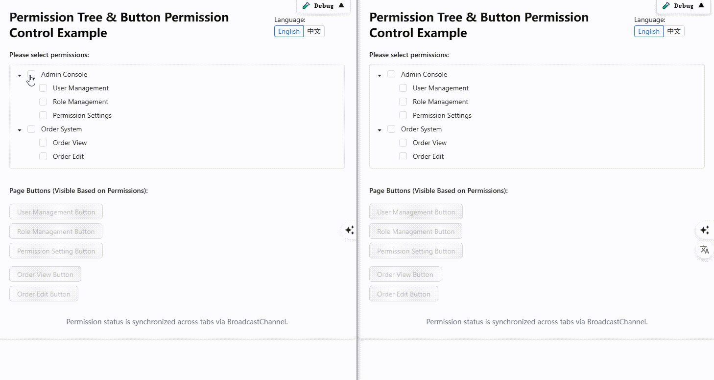

# react-simple-channel 🌐📡

[中文 🇨🇳](./README.zh-CN.md)

> DeepWiki Knowledge Base Document -> [react-simple-channel](https://deepwiki.com/aiyoudiao/react-simple-channel)  
> A lightweight React communication tool for multiple browser tabs, supporting both traditional functions and Hooks.


[View Demo](https://aiyoudiao.github.io/react-simple-channel/demo-dist/index.html)
|
[View Storybook](https://aiyoudiao.github.io/react-simple-channel/storybook-static/index.html)

<p align="center">
    
</p>

---

## ✨ Features

- 📡 **Multi-tab communication** based on the browser's `BroadcastChannel`
- 🔧 **Supports both React and non-React environments**
- ⏱️ **Built-in support for debounce and throttle**
- 🧩 **Built-in `onChange(fromRemote)` callback to distinguish local vs. remote changes**
- ⚛️ **Available via `Hook` or traditional utility function**
- 🧪 **Tested with TypeScript, Vitest, @testing-library/react, and Playwright**
- 💅 **Example pages using Tailwind + Ant Design + Storybook**

---

## 📦 Installation

```bash
npm install react-simple-channel
````

Or using yarn:

```bash
yarn add react-simple-channel
```

Or with pnpm:

```bash
pnpm add react-simple-channel
```

---

## 🔧 Usage

### 1️⃣ Using Hook in React

Synchronizing permission selections across tabs (React + TypeScript):

```tsx
import React from 'react';
import { Tree } from 'antd';
import type { DataNode } from 'antd/es/tree';
import { useBroadcastSync } from 'react-simple-channel';

type PermissionKey = string;
const CHANNEL_NAME = 'app-permission-sync';

// Example permission tree
const treeData: DataNode[] = [
  {
    title: 'System Settings',
    key: 'system',
    children: [
      { title: 'User Management', key: 'user_manage' },
      { title: 'Permission Config', key: 'permission_config' },
    ],
  },
];

const App: React.FC = () => {
  const [checkedKeys, setCheckedKeys] = useBroadcastSync<PermissionKey[]>(
    CHANNEL_NAME,
    [],
    {
      debounceMs: 200,
      // throttleMs: 1000, // Optional: throttle duration
    }
  );

  return (
    <div style={{ maxWidth: 400, margin: '2rem auto' }}>
      <h2>Permission Settings (Cross-Tab Sync)</h2>
      <Tree
        checkable
        treeData={treeData}
        checkedKeys={checkedKeys}
        onCheck={(keys) =>
          setCheckedKeys(Array.isArray(keys) ? keys : keys.checked)
        }
      />
    </div>
  );
};

export default App;
```

---

### 2️⃣ Using Utility Functions in Non-React Scenarios

```ts
import { BroadcastSync } from 'react-simple-channel';

type PermissionKey = string;
const CHANNEL_NAME = 'app-permission-sync';

const appPermissionChannel = BroadcastSync.query(CHANNEL_NAME);
// const appPermissionChannel = BroadcastSync.query(CHANNEL_NAME, {
//   debounceMs: 200, // Optional: debounce duration
//   // throttleMs: 1000, // Optional: throttle duration
// });

// Listen for changes; `fromRemote` indicates if the change came from another tab
appPermissionChannel.addEventListener((data, fromRemote) => {
  console.log('Received:', data, 'fromRemote:', fromRemote);
});

appPermissionChannel.post(['user_manage', 'permission_config']);
```

---

## 🧪 Testing

Tests are written with [`vitest`](https://vitest.dev), [`@testing-library/react`](https://testing-library.com/), and [`@playwright/test`](https://playwright.dev/).

```bash
pnpm test

pnpm run dev:demo
pnpm run e2e-test
```

* `jsdom` is used to simulate typical multi-tab communication behavior in tests.
* `playwright` is used to test communication across actual browser tabs.

---

## 📘 Example Page (Storybook)

```bash
pnpm storybook
```

* ✨ Tailwind CSS
* 🎨 Ant Design 5
* 📖 Interactive component demos

---

## 📁 Project Structure

```
src/toolkit
  index.ts
  broadcastSync.ts
  useBroadcastSync.tsx
```

---

## 🤝 Contributing

PRs and issues are welcome! Let’s build something great together.

---

## 📄 License

[MIT](./LICENSE) by [@aiyoudiao](https://github.com/aiyoudiao)

---

## 💬 Acknowledgements

* [broadcast-channel](https://github.com/pubkey/broadcast-channel): A **modern BroadcastChannel wrapper** that works in legacy/new browsers, WebWorkers, and Node.js
* [Vitest](https://vitest.dev/): A modern unit testing framework
* [Playwright](https://playwright.dev/): Modern end-to-end testing solution
* [Storybook](https://storybook.js.org/): Tool for building interactive component showcases

---

Powered by [broadcast-channel](https://github.com/pubkey/broadcast-channel) and [React](https://reactjs.org/) ❤️
