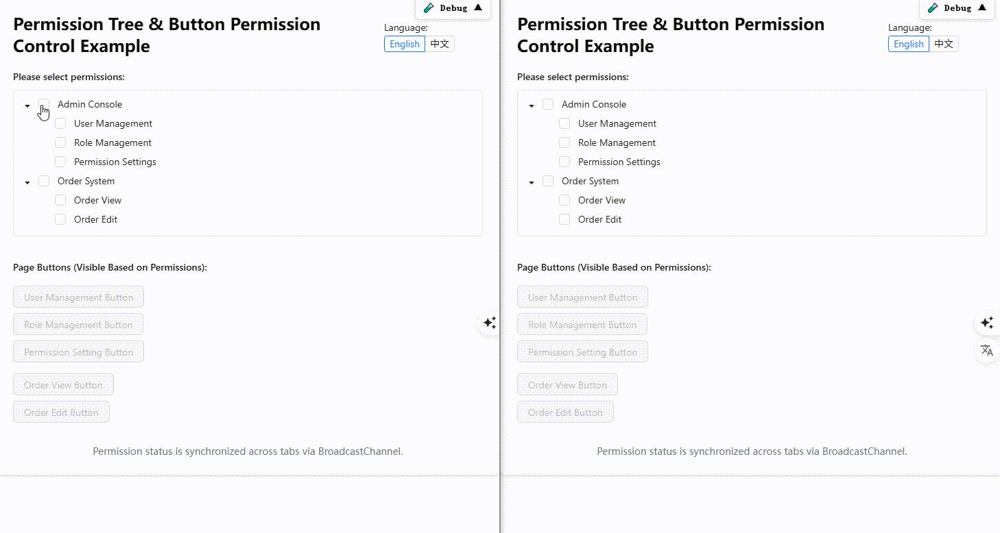

# react-simple-channel 🌐📡


[English 🇺🇸](./README.md)

> 一个轻量的 React 多标签页通信工具，支持传统函数和 Hook 两种方式。


[访问示例](https://aiyoudiao.github.io/react-simple-channel/demo-dist/index.html)
|
[访问 Storybook 示例](https://aiyoudiao.github.io/react-simple-channel/storybook-static/index.html)

<p align="center">
    
</p>

---

## ✨ 特性亮点

- 📡 **多标签页通信**，基于浏览器 `BroadcastChannel` 实现
- 🔧 **支持 React 与非 React 场景**
- ⏱️ **支持防抖（debounce）与节流（throttle）**
- 🧩 **内置 `onChange(fromRemote)` 回调，可区分远程与本地修改**
- ⚛️ **支持 `Hook` 和传统工具函数两种调用方式**
- 🧪 **基于 TypeScript、Vitest、@testing-library/react、playwright 编写测试**
- 💅 **提供 Tailwind + Ant Design + Storybook 示例页面**

---

## 📦 安装使用

```bash
npm install react-simple-channel
````

或者使用 yarn：

```bash
yarn add react-simple-channel
```

或者使用 pnpm:

```bash
pnpm add react-simple-channel
```

---

## 🔧 使用方式

### 1️⃣ React 中使用 Hook

跨标签页同步权限勾选（React + TypeScript）

```tsx
import React from 'react';
import { Tree } from 'antd';
import type { DataNode } from 'antd/es/tree';
import { useBroadcastSync } from 'react-simple-channel';

type PermissionKey = string;
const CHANNEL_NAME = 'app-permission-sync';

// 示例权限树
const treeData: DataNode[] = [
  {
    title: '系统设置',
    key: 'system',
    children: [
      { title: '用户管理', key: 'user_manage' },
      { title: '权限配置', key: 'permission_config' },
    ],
  },
];

const App: React.FC = () => {
  const [checkedKeys, setCheckedKeys] = useBroadcastSync<PermissionKey[]>(
    CHANNEL_NAME,
    [],
    { debounceMs: 200,
      // throttleMs: 1000, // 可选，节流时间
    }
  );

  return (
    <div style={{ maxWidth: 400, margin: '2rem auto' }}>
      <h2>权限设置（多标签页同步）</h2>
      <Tree
        checkable
        treeData={treeData}
        checkedKeys={checkedKeys}
        onCheck={(keys) =>
          setCheckedKeys(Array.isArray(keys) ? keys : keys.checked)
        }
      />
    </div>
  );
};

export default App;

```

---

### 2️⃣ 非 React 场景使用工具函数

```ts
import { BroadcastSync } from 'react-simple-channel';


type PermissionKey = string;
const CHANNEL_NAME = 'app-permission-sync';

const appPermissionChannel = BroadcastSync.query(CHANNEL_NAME);
// const appPermissionChannel = BroadcastSync.query(CHANNEL_NAME, {
//   debounceMs: 200, // 可选，防抖时间
//   // throttleMs: 1000, // 可选，节流时间
// });

// 可以监听是否由变更，`fromRemote` 参数表示是否来自其他标签页的变更
appPermissionChannel.addEventListener((data, fromRemote) => {
  console.log('Received:', data, 'fromRemote:', fromRemote);
});

appPermissionChannel.post(['user_manage', 'permission_config']);

```

---

## 🧪 测试

使用 [`vitest`](https://cn.vitest.dev)、[`@testing-library/react`](https://testing-library.com/)、[`@playwright/test`](https://playwright.dev/) 编写测试。

```bash
pnpm test

pnpm run dev:demo
pnpm run e2e-test
```

测试中使用 jsdom 中测试常规标签页通信行为。
测试中使用 playwright 用于测试实际浏览器环境下的多标签页通信。

---

## 📘 示例页面（Storybook）

```bash
pnpm storybook
```

* ✨ Tailwind CSS
* 🎨 Ant Design 5
* 📖 交互式组件演示

---

## 📁 项目结构

```
src/toolkit
  index.ts
  broadcastSync.ts
  useBroadcastSync.tsx
```

---

## 🤝 欢迎贡献

欢迎提交 PR 或 Issue，共同完善本工具库！

---

## 📄 许可证

[MIT](./LICENSE) [@哎哟迪奥](https://github.com/aiyoudiao)

---

## 💬 鸣谢

* [broadcast-channel](https://github.com/pubkey/broadcast-channel)：**可在旧浏览器、新浏览器、WebWorkers 和 NodeJs 中运行的 BroadcastChannel**的底层封装库
* [Vitest](https://vitest.dev/)：现代化的测试框架
* [Playwright](https://playwright.dev/)：提供现代化的端到端测试
* [Storybook](https://storybook.js.org/)：用于构建交互式组件示例的工具

---

由 [broadcast-channel](https://github.com/pubkey/broadcast-channel) 和 [React](https://reactjs.org/) ❤️ 驱动开发
